Pridemoji
=========

A collection of pride-themed emoji for slack/discord/etc.

## Emojis

[Download everything](https://github.com/tschrock/pridemoji/archive/refs/heads/main.zip)

| Id                     | Emoji                                                       |  Download  |
|------------------------|-------------------------------------------------------------|:----------:|
| ace_pride_flag         |                  | [png](https://raw.githubusercontent.com/tschrock/pridemoji/main/png/ace_pride_flag.png) &nbsp; [svg](https://raw.githubusercontent.com/tschrock/pridemoji/main/svg/ace_pride_flag.svg) |
| aro_pride_flag         |                  | [png](https://raw.githubusercontent.com/tschrock/pridemoji/main/png/aro_pride_flag.png) &nbsp; [svg](https://raw.githubusercontent.com/tschrock/pridemoji/main/svg/aro_pride_flag.svg) |
| bi_pride_flag          |                    | [png](https://raw.githubusercontent.com/tschrock/pridemoji/main/png/bi_pride_flag.png) &nbsp; [svg](https://raw.githubusercontent.com/tschrock/pridemoji/main/svg/bi_pride_flag.svg) |
| enby_pride_flag        |                | [png](https://raw.githubusercontent.com/tschrock/pridemoji/main/png/enby_pride_flag.png) &nbsp; [svg](https://raw.githubusercontent.com/tschrock/pridemoji/main/svg/enby_pride_flag.svg) |
| gay_pride_flag         |                  | [png](https://raw.githubusercontent.com/tschrock/pridemoji/main/png/gay_pride_flag.png) &nbsp; [svg](https://raw.githubusercontent.com/tschrock/pridemoji/main/svg/gay_pride_flag.svg) |
| genderfluid_pride_flag |  | [png](https://raw.githubusercontent.com/tschrock/pridemoji/main/png/genderfluid_pride_flag.png) &nbsp; [svg](https://raw.githubusercontent.com/tschrock/pridemoji/main/svg/genderfluid_pride_flag.svg) |
| genderqueer_pride_flag |  | [png](https://raw.githubusercontent.com/tschrock/pridemoji/main/png/genderqueer_pride_flag.png) &nbsp; [svg](https://raw.githubusercontent.com/tschrock/pridemoji/main/svg/genderqueer_pride_flag.svg) |
| lesbian_pride_flag     |          | [png](https://raw.githubusercontent.com/tschrock/pridemoji/main/png/lesbian_pride_flag.png) &nbsp; [svg](https://raw.githubusercontent.com/tschrock/pridemoji/main/svg/lesbian_pride_flag.svg) |
| pan_pride_flag         |                  | [png](https://raw.githubusercontent.com/tschrock/pridemoji/main/png/pan_pride_flag.png) &nbsp; [svg](https://raw.githubusercontent.com/tschrock/pridemoji/main/svg/pan_pride_flag.svg) |
| polysexual_pride_flag  |          | [png](https://raw.githubusercontent.com/tschrock/pridemoji/main/png/polysexual_pride_flag.png) &nbsp; [svg](https://raw.githubusercontent.com/tschrock/pridemoji/main/svg/polysexual_pride_flag.svg) |
| trans_pride_flag       |              | [png](https://raw.githubusercontent.com/tschrock/pridemoji/main/png/trans_pride_flag.png) &nbsp; [svg](https://raw.githubusercontent.com/tschrock/pridemoji/main/svg/trans_pride_flag.svg) |
| ace_syringe            |                        | [png](https://raw.githubusercontent.com/tschrock/pridemoji/main/png/ace_syringe.png) &nbsp; [svg](https://raw.githubusercontent.com/tschrock/pridemoji/main/svg/ace_syringe.svg) |
| agender_syringe        | 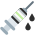               | [png](https://raw.githubusercontent.com/tschrock/pridemoji/main/png/agender_syringe.png) &nbsp; [svg](https://raw.githubusercontent.com/tschrock/pridemoji/main/svg/agender_syringe.svg) |
| aro_syringe            | 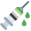                       | [png](https://raw.githubusercontent.com/tschrock/pridemoji/main/png/aro_syringe.png) &nbsp; [svg](https://raw.githubusercontent.com/tschrock/pridemoji/main/svg/aro_syringe.svg) |
| bi_syringe             | 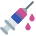                         | [png](https://raw.githubusercontent.com/tschrock/pridemoji/main/png/bi_syringe.png) &nbsp; [svg](https://raw.githubusercontent.com/tschrock/pridemoji/main/svg/bi_syringe.svg) |
| enby_syringe           | 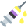                     | [png](https://raw.githubusercontent.com/tschrock/pridemoji/main/png/enby_syringe.png) &nbsp; [svg](https://raw.githubusercontent.com/tschrock/pridemoji/main/svg/enby_syringe.svg) |
| gay_syringe            | 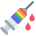                       | [png](https://raw.githubusercontent.com/tschrock/pridemoji/main/png/gay_syringe.png) &nbsp; [svg](https://raw.githubusercontent.com/tschrock/pridemoji/main/svg/gay_syringe.svg) |
| genderfluid_syringe    | 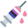       | [png](https://raw.githubusercontent.com/tschrock/pridemoji/main/png/genderfluid_syringe.png) &nbsp; [svg](https://raw.githubusercontent.com/tschrock/pridemoji/main/svg/genderfluid_syringe.svg) |
| genderqueer_syringe    |        | [png](https://raw.githubusercontent.com/tschrock/pridemoji/main/png/genderqueer_syringe.png) &nbsp; [svg](https://raw.githubusercontent.com/tschrock/pridemoji/main/svg/genderqueer_syringe.svg) |
| lesbian_syringe        | 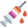               | [png](https://raw.githubusercontent.com/tschrock/pridemoji/main/png/lesbian_syringe.png) &nbsp; [svg](https://raw.githubusercontent.com/tschrock/pridemoji/main/svg/lesbian_syringe.svg) |
| pan_syringe            | 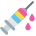                       | [png](https://raw.githubusercontent.com/tschrock/pridemoji/main/png/pan_syringe.png) &nbsp; [svg](https://raw.githubusercontent.com/tschrock/pridemoji/main/svg/pan_syringe.svg) |
| polyamorous_syringe    | 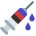       | [png](https://raw.githubusercontent.com/tschrock/pridemoji/main/png/polyamorous_syringe.png) &nbsp; [svg](https://raw.githubusercontent.com/tschrock/pridemoji/main/svg/polyamorous_syringe.svg) |
| polysexual_syringe     |          | [png](https://raw.githubusercontent.com/tschrock/pridemoji/main/png/polysexual_syringe.png) &nbsp; [svg](https://raw.githubusercontent.com/tschrock/pridemoji/main/svg/polysexual_syringe.svg) |
| trans_syringe_blue     |          | [png](https://raw.githubusercontent.com/tschrock/pridemoji/main/png/trans_syringe_blue.png) &nbsp; [svg](https://raw.githubusercontent.com/tschrock/pridemoji/main/svg/trans_syringe_blue.svg) |
| trans_syringe_pink     | 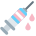         | [png](https://raw.githubusercontent.com/tschrock/pridemoji/main/png/trans_syringe_pink.png) &nbsp; [svg](https://raw.githubusercontent.com/tschrock/pridemoji/main/svg/trans_syringe_pink.svg) |
| trans_syringe          | 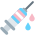                   | [png](https://raw.githubusercontent.com/tschrock/pridemoji/main/png/trans_syringe.png) &nbsp; [svg](https://raw.githubusercontent.com/tschrock/pridemoji/main/svg/trans_syringe.svg) |

## License

All emoji here are based on Twitter's [Twemoji](https://twemoji.twitter.com/) and therefore fall under the same licensing restrictions.

Code licensed under the MIT License: http://opensource.org/licenses/MIT

Graphics licensed under CC-BY 4.0: https://creativecommons.org/licenses/by/4.0/
